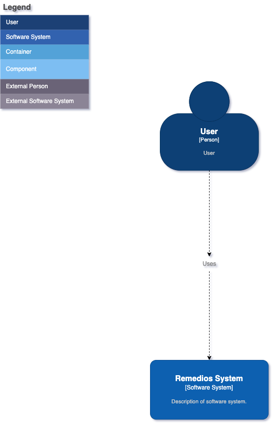

## 1. Diagrama de Contexto

### Objetivo

Mostrar como o sistema se relaciona com outros sistemas externos e usuários.

### Passos

1. **Identificar os Sistemas Externos**: Liste todos os sistemas externos que interagem com o seu sistema.
2. **Identificar os Usuários**: Determine quem são os usuários finais do seu sistema.
3. **Criar o Diagrama**: Use uma ferramenta de diagramação para representar o seu sistema como um grande bloco no centro. Adicione os sistemas externos e usuários ao redor, conectando-os ao seu sistema com linhas que representam as interações.

#### Diagrama de contexto
    
