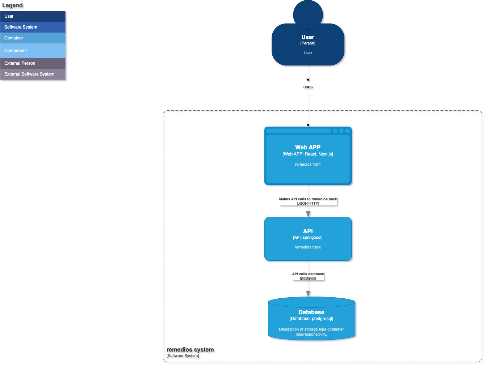

## 2. Diagrama de Containers

### Objetivo

Descrever as aplicações de alto nível, os serviços, e os bancos de dados que compõem o sistema.

### Passos

1. **Identificar Containers**: Identifique os principais containers dentro do seu sistema. Isso pode incluir serviços web, aplicativos móveis, bancos de dados, etc.
2. **Criar o Diagrama**: Represente cada container como um bloco dentro do sistema. Mostre como os containers interagem entre si e com sistemas externos.

